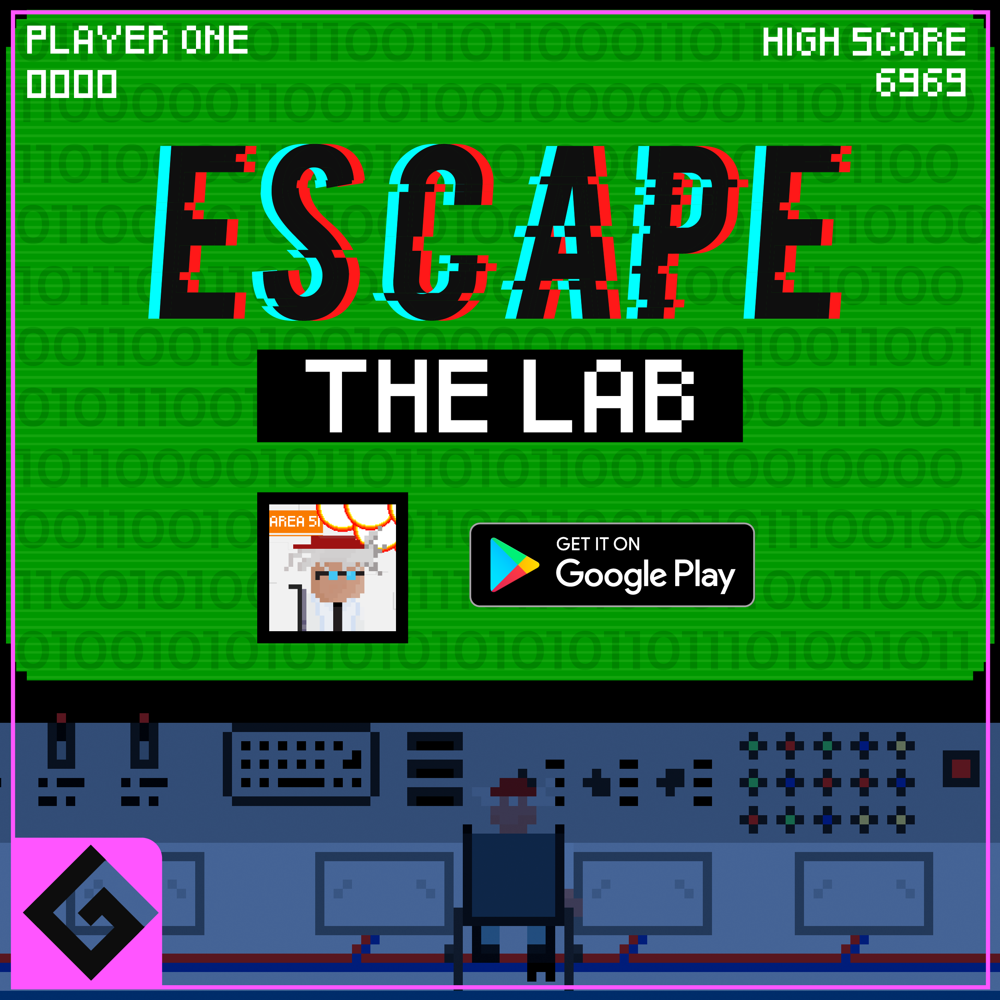
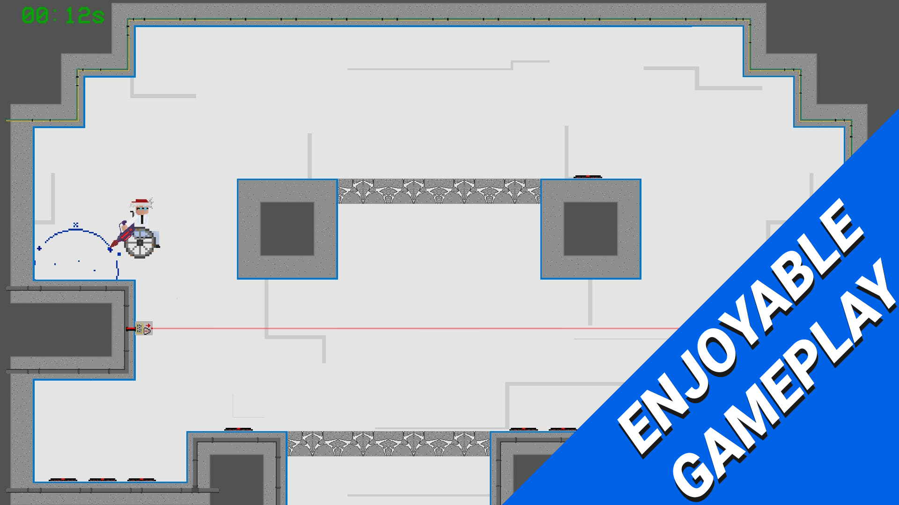
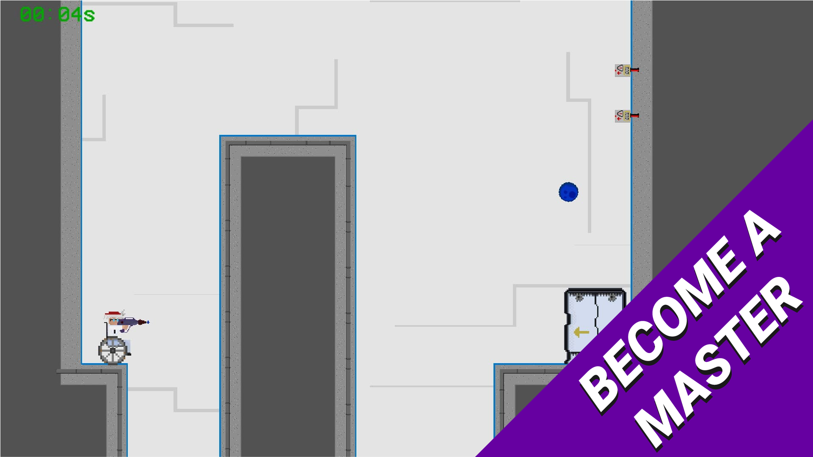
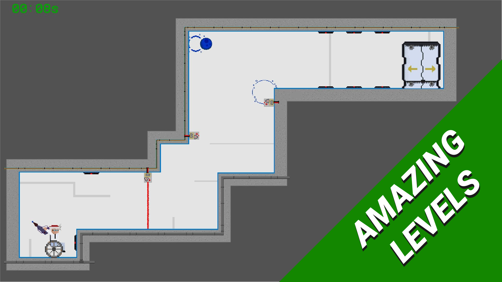

# Unity Game - Escape the Lab  

Pliki źródłowe gry o nazwie "Escape the Lab".  
Gra posiada **osiemnaście** dostępnych do grania poziomów oraz została umieszczona na sklepie **Google Play**. 

[link do profilu z naszymi grami - Google Play](https://play.google.com/store/apps/dev?id=6893354586300001935)  
[link do pobrania gry - Google Play](https://play.google.com/store/apps/details?id=com.GeekBox.EscapeTheLab)

W grze umieszczone zostały elementy:

- Autorska grafika elementów otoczenia oraz postaci.
- Osiemnaście przetestowanych poziomów.
- Przygotowanie miejsca na umieszczenie reklam oraz RODO (Zaimplementowane w wersji umieszczonej na sklepie Play).
- Efekty dźwiękowe podczas rozgrywki oraz interakcji z przyciskami.

### Technologie

Przy tworzeniu gry zostały wykorzystane następujące technologie:

- Unity - Silnik gry, na którym została w całości stworzona.
- C#    - Język programowania użyty do napisania logiki gry.

## Zrzuty ekranu z gry

